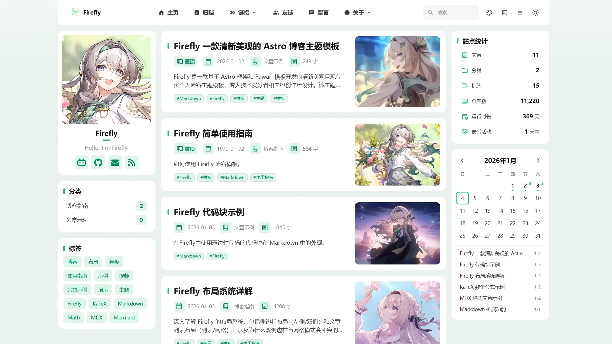
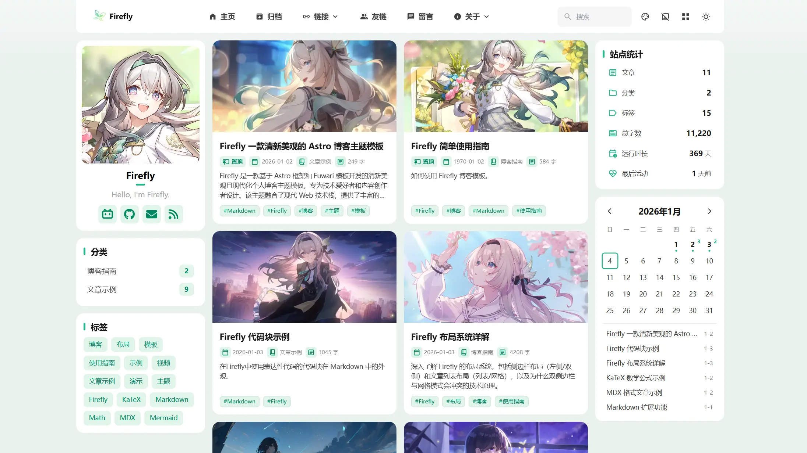

## 📖 Resumen

Firefly ofrece un sistema de diseño flexible que te permite personalizar la presentación visual de tu blog según tus necesidades de contenido y preferencias personales. El sistema de diseño se compone principalmente de dos dimensiones: el **diseño de la barra lateral** y el **diseño de la lista de artículos**, que trabajan en conjunto para determinar la estructura general de la página.

Este artículo detallará los diversos modos de diseño de Firefly, sus características, escenarios de uso y el efecto de las diferentes combinaciones de diseño.

---

## I. Sistema de Diseño de la Barra Lateral

La barra lateral es una parte importante de la página del blog, utilizada para mostrar navegación, categorías, etiquetas, estadísticas y otro contenido auxiliar. Firefly admite dos modos de diseño de barra lateral.

### 1.1 Modo de Barra Lateral Izquierda (position: "left")

#### Características

- La barra lateral está fija en el lado izquierdo de la página
- El área de contenido principal está en el lado derecho
- Se ajusta a los hábitos de lectura de izquierda a derecha
- Adecuado para mostrar información importante como navegación y categorías

#### Estructura del Diseño


#### Escenarios de Aplicación

- Estilo de blog tradicional
- Blogs que enfatizan la navegación y las categorías
- Blogs personales que necesitan destacar el perfil del usuario
- Escenarios donde el contenido es lo principal y la información auxiliar es secundaria

:::tip
Al habilitar la barra lateral única izquierda, la navegación del índice de artículos ubicada en la barra lateral derecha de la página de detalles del artículo quedará inhabilitada.

Se usará en su lugar una navegación de índice flotante, que requiere hacer clic manualmente para mostrarse.

Sin embargo, puedes configurar si deseas mostrar la barra lateral derecha en la página de detalles del artículo mediante `showRightSidebarOnPostPage`.

Cuando `position` es `left` y se habilita esta opción, la página de detalles del artículo mostrará barras laterales duales, mientras que la página de inicio y otras páginas mantendrán la barra lateral única izquierda.

Es adecuado para escenarios donde solo quieres usar la barra lateral única izquierda, pero deseas usar componentes como el índice de la barra lateral derecha en la página de detalles del artículo.
:::

#### Ejemplo de Configuración

```typescript
// src/config/sidebarConfig.ts
export const sidebarLayoutConfig: SidebarLayoutConfig = {
  enable: true,
  position: "left", // Barra lateral izquierda
  showRightSidebarOnPostPage: true, // Mostrar barra lateral derecha en la página de artículos
};
```

---

### 1.2 Modo de Barras Laterales Duales (position: "both")

#### Características

- Existen barras laterales en ambos lados simultáneamente
- El área de contenido principal se encuentra en el medio
- Maximiza el uso del espacio de la pantalla
- Permite mostrar más información auxiliar
- Adecuado para monitores de pantalla ancha

#### Estructura del Diseño



#### Escenarios de Aplicación

- Navegación en escritorio de pantalla ancha
- Blogs con alta densidad de información
- Necesidad de mostrar una gran cantidad de contenido auxiliar
- Blogs técnicos con un fuerte enfoque profesional

#### Ejemplo de Configuración

```typescript
// src/config/sidebarConfig.ts
export const sidebarLayoutConfig: SidebarLayoutConfig = {
  enable: true,
  position: "both", // Barras laterales duales
};
```

---

## II. Sistema de Diseño de Lista de Artículos

La lista de artículos es el contenido central de la página de inicio y la página de archivos del blog. Firefly ofrece dos formas de visualización y admite múltiples configuraciones de cuadrícula.

### 2.1 Modo de Lista (defaultMode: "list")

#### Características

- Disposición vertical en una sola columna
- Muestra la imagen de portada del artículo
- Muestra más fragmentos del artículo
- Adecuado para una lectura profunda

#### Estructura de Diseño de Lista


#### Ventajas

- ✅ Fuerte impacto visual, la imagen de portada atrae la atención
- ✅ Permite mostrar más información del artículo (resumen, etiquetas, etc.)
- ✅ Adecuado para blogs con abundante contenido visual
- ✅ Amigable para dispositivos móviles, la columna única es más fácil de leer
- ✅ Compatible con todas las configuraciones de barra lateral (única o dual)

#### Ejemplo de Configuración

```typescript
// src/config/siteConfig.ts
export const siteConfig: SiteConfig = {
  postListLayout: {
    defaultMode: "list", // Modo lista
    allowSwitch: true,   // Permitir al usuario cambiar
  },
};
```

---

### 2.2 Modo de Cuadrícula (defaultMode: "grid")

#### Características

- Disposición horizontal en múltiples columnas (admite 2 o 3 columnas)
- Diseño compacto, alta densidad de información
- Adecuado para una navegación rápida

#### 2.2.1 Cuadrícula de Dos Columnas (Columns: 2)

Esta es la configuración predeterminada para el modo de cuadrícula, adecuada para la mayoría de los escenarios.


#### 2.2.2 Cuadrícula de Tres Columnas (Columns: 3) ✨ Nuevo

En dispositivos de pantalla ancha, puedes habilitar el modo de cuadrícula de tres columnas para aumentar aún más la densidad de información.


**⚠️ Nota**: El modo de cuadrícula de tres columnas solo es efectivo en el **modo de barra lateral izquierda** (o sin barra lateral). Si habilitas las barras laterales duales, el sistema volverá automáticamente a la cuadrícula de dos columnas para asegurar que las tarjetas de los artículos tengan suficiente ancho de visualización.

#### Ejemplo de Configuración

```typescript
// src/config/siteConfig.ts
export const siteConfig: SiteConfig = {
  postListLayout: {
    defaultMode: "grid",
    allowSwitch: true,
    grid: {
      masonry: true,  // Habilitar diseño de cascada (masonry)
      columns: 3,     // Configurar modo de 3 columnas (solo barra lateral única)
    },
  },
};
```

---

## III. Guía de Combinaciones de Diseño

Firefly te permite combinar libremente la barra lateral y el diseño de la lista de artículos. A continuación, se explican los efectos de las diversas combinaciones.

### 3.1 Barra Lateral Izquierda + Modo de Cuadrícula

Esta es la combinación más flexible. Puedes elegir una cuadrícula de 2 o 3 columnas.

- **Modo de 2 columnas**: Diseño de cuadrícula clásico, ancho de tarjeta moderado, lectura cómoda.
- **Modo de 3 columnas**: Adecuado para pantallas anchas (≥1024px), muestra más contenido en una sola pantalla, efecto visual impactante.

### 3.2 Barras Laterales Duales + Modo de Cuadrícula

En versiones anteriores, esta combinación estaba deshabilitada. Sin embargo, en la última versión de Firefly, hemos eliminado las restricciones, permitiendo que las barras laterales duales coexistan con el modo de cuadrícula.



**Características y Limitaciones**:
- **Forzado a Dos Columnas**: Incluso si configuras `columns: 3`, en este modo se forzará la visualización a 2 columnas.
- **Espacio Compacto**: Debido a las barras laterales en ambos lados, el área de contenido principal en el medio es relativamente estrecha.
- **Densidad de Información Extrema**: Esta es la forma de diseño con mayor densidad de información, adecuada para sitios que necesitan mostrar una gran cantidad de información de navegación y listas de artículos simultáneamente.

### 3.3 Sugerencias de Elección de Diseño

| Modo de Barra Lateral | Modo de Lista de Artículos | Recomendación | Escenario de Aplicación |
|-----------------------|----------------------------|---------------|-------------------------|
| Barra Lateral Izquierda | Modo de Lista              | ⭐⭐⭐⭐⭐ | Fotografía, diseño, blogs de estilo de vida, énfasis en imagen e inmersión |
| Barra Lateral Izquierda | Cuadrícula de 2 columnas   | ⭐⭐⭐⭐⭐ | Blogs técnicos, de notas, equilibrio entre lectura y eficiencia de búsqueda |
| Barra Lateral Izquierda | Cuadrícula de 3 columnas   | ⭐⭐⭐⭐⭐ | Sitios con gran volumen de contenido, excelente experiencia en pantalla ancha |
| Barras Laterales Duales | Modo de Lista              | ⭐⭐⭐⭐⭐ | Sitios que necesitan mostrar mucha información en las barras laterales |
| Barras Laterales Duales | Cuadrícula de 2 columnas   | ⭐⭐⭐⭐⭐ | Estilo geek, buscando la máxima densidad de información |

---

## IV. Comportamiento del Diseño Responsivo

El sistema de diseño de Firefly cuenta con un diseño responsivo inteligente que se ajusta automáticamente según el tamaño de la pantalla.

### 4.1 Reglas de Degradación Inteligente

Para garantizar la mejor experiencia de lectura, el sistema ajustará automáticamente el diseño cuando la pantalla se estreche:

1. **Cuadrícula de 3 columnas -> Cuadrícula de 2 columnas**: Cuando el ancho de la pantalla no es suficiente para acomodar 3 columnas (o cuando se habilitan barras laterales duales), se degrada automáticamente.
2. **Modo de Cuadrícula -> Modo de Lista**: Cuando el ancho de la pantalla es inferior a 1200px (tabletas y móviles), el modo de cuadrícula cambiará automáticamente al modo de lista de una sola columna para garantizar la legibilidad del contenido de la tarjeta.
3. **Barras Laterales Duales -> Barra Lateral Izquierda**: Cuando el ancho de la pantalla es inferior a 1280px, la barra lateral derecha se ocultará automáticamente y la navegación del índice del artículo cambiará a una navegación de índice flotante.

---

## V. Preguntas Frecuentes

### P1: ¿Por qué he configurado una cuadrícula de 3 columnas pero solo se muestran 2?

**R**: Comprueba los siguientes puntos:
1. ¿Has habilitado las barras laterales duales (`position: "both"`)? El modo de barras laterales duales fuerza a 2 columnas.
2. ¿Es el ancho de la pantalla suficiente? El modo de 3 columnas suele requerir un ancho ≥1024px.

### P2: ¿Por qué no veo el efecto de cuadrícula en el móvil?

**R**: Para garantizar la experiencia de lectura, Firefly cambia automáticamente de forma forzada al modo de lista cuando el ancho de la pantalla es inferior a 1200px. Las pantallas de los móviles son demasiado estrechas para mostrar cuadrículas de múltiples columnas de forma adecuada.

### P3: ¿Dónde está el botón de cambio de diseño?

**R**: El botón de cambio de diseño se encuentra en el lado derecho de la barra de navegación. Solo se muestra cuando el ancho de la pantalla es ≥ 1200px, ya que en pantallas pequeñas el sistema fuerza el uso del modo de lista, por lo que no es necesario cambiar.

---

## VI. Resumen

El nuevo sistema de diseño de Firefly te brinda mayor libertad. Ya sea que busques el impacto visual de una **cuadrícula de tres columnas** o la densidad de información de una **cuadrícula de barras laterales duales**, puedes lograrlo con una configuración sencilla.

Te recomendamos que pruebes diferentes combinaciones según tu tipo de contenido y las preferencias de dispositivo de tus lectores para encontrar la forma de blog que mejor se adapte a ti.

---

## Enlaces Relacionados

- 📚 [Documentación de configuración de barra lateral](https://docs-firefly.cuteleaf.cn/config/sidebarConfig-usage/)
- 📚 [Documentación de configuración del sitio](https://docs-firefly.cuteleaf.cn/config/siteConfig-usage/)
- 🏠 [Documentación oficial de Firefly](https://docs-firefly.cuteleaf.cn/)
- ⭐ [GitHub de Firefly](https://github.com/CuteLeaf/Firefly)
