# Guía completa de gráficos Mermaid en Markdown

Este artículo demuestra cómo usar Mermaid en documentos Markdown para crear diversos gráficos complejos, incluyendo diagramas de flujo, diagramas de secuencia, diagramas de Gantt, diagramas de clases y diagramas de estado.

## Ejemplo de diagrama de flujo

Los diagramas de flujo son excelentes para representar procesos o pasos de un algoritmo.

```mermaid
graph TD
    A[Inicio] --> B{Comprobación de condición}
    B -->|Sí| C[Paso de procesamiento 1]
    B -->|No| D[Paso de procesamiento 2]
    C --> E[Subproceso]
    D --> E
    subgraph E [Detalles del subproceso]
        E1[Subpaso 1] --> E2[Subpaso 2]
        E2 --> E3[Subpaso 3]
    end
    E --> F{Otra decisión}
    F -->|Opción 1| G[Resultado 1]
    F -->|Opción 2| H[Resultado 2]
    F -->|Opción 3| I[Resultado 3]
    G --> J[Fin]
    H --> J
    I --> J
```

## Ejemplo de diagrama de secuencia

Los diagramas de secuencia muestran la interacción entre objetos a lo largo del tiempo.

## Ejemplo de diagrama de Gantt

Los diagramas de Gantt son ideales para mostrar el progreso y el cronograma de un proyecto.

## Ejemplo de diagrama de clases

Los diagramas de clases muestran la estructura estática del sistema, incluyendo clases, atributos, métodos y sus relaciones.

## Ejemplo de diagrama de estado

Los diagramas de estado muestran la secuencia de estados por los que pasa un objeto durante su ciclo de vida.

## Ejemplo de gráfico de tarta

Los gráficos de tarta son ideales para mostrar proporciones y datos porcentuales.

## Resumen

Mermaid es una herramienta poderosa para crear diversos tipos de gráficos en documentos Markdown. Este artículo ha demostrado cómo usar diagramas de flujo, diagramas de secuencia, diagramas de Gantt, diagramas de clases, diagramas de estado y gráficos de tarta. Estos gráficos pueden ayudarte a expresar conceptos, procesos y estructuras de datos complejos de manera más clara.

Para usar Mermaid, simplemente especifica el lenguaje mermaid en un bloque de código y usa una sintaxis de texto concisa para describir el gráfico. Mermaid convertirá automáticamente estas descripciones en hermosos gráficos visuales.

¡Intenta usar gráficos Mermaid en tu próximo artículo técnico de blog o documento de proyecto: harán que tu contenido sea más profesional y fácil de entender!